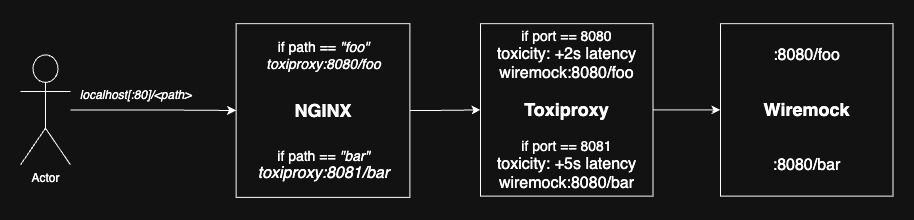

# NginxToxiproxyByEndpoint

**Problem statement:** You want to run chaos tests with different timeouts for different endpoints on the _**same**_ downstream service. Toxiproxy provides only service-level latency and downtime simulation, but we would like the flexibility to simulate network latency and service downtime on a per-endpoint basis, to match our needs.

This example is an experiment in using NGINX as a reverse-proxy to route requests to different WireMock servers, via Toxiproxy, based on the path of the request. While also setting up Toxiproxy to apply toxicity to the wiremock servers separately, this will enable us to simulate per-endpoint latency or downtime, as we could deploy the same wiremock image and mocks as different services, each with their own toxicity, using NGINX to route traffic to each depending on the original request path.



In a very simple flow:

`localhost[:80]/hello` -> `toxiproxy:8080/hello` -> `wiremock_a:8080/hello`

`localhost[:80]/goodbye` -> `toxiproxy:8081/goodbye` -> `wiremock_b:8081/goodbye`

You'll notice that the response times are different, this is because the `goodbye` endpoint routes through to a wiremock host which has had a toxicity of 5 second latency applied to it via Toxiproxy.

### To run this example locally

```shell
docker compose down && docker compose up -d
```

### Checking Toxiproxy configuration

**Note:** This does not work in the browser due to an [issue](https://github.com/Shopify/toxiproxy/issues/219) with User-Agent in Toxiproxy.

Request:
```shell
curl http://localhost:8474/proxies
```

Response:
```json
{
  "wiremock_a": {
    "name": "wiremock_a",
    "listen": "[::]:8080",
    "upstream": "wiremock_a:8080",
    "enabled": false,
    "Logger": {},
    "toxics": []
  },
  "wiremock_b": {
    "name": "wiremock_b",
    "listen": "[::]:8081",
    "upstream": "wiremock_b:8081",
    "enabled": false,
    "Logger": {},
    "toxics": []
  }
}
```

### Manually configuring toxicity on Toxiproxy via curl

Request:
```shell
curl -X POST -d '{"type" : "latency", "attributes" : {"latency" : 10000}}' http://localhost:8474/proxies/wiremock_a/toxics
```

Response:
```json
{
  "attributes": {
    "latency": 10000,
    "jitter": 0
  },
  "name": "latency_downstream",
  "type": "latency",
  "stream": "downstream",
  "toxicity": 1
}                                                                            ➜  ~
```

### Sources:
- [NGINX Docs: NGINX Reverse Proxy](https://docs.nginx.com/nginx/admin-guide/web-server/reverse-proxy/).
- [Medium: ToxiProxy — Testing automated chaos scenarios](https://medium.com/@mustafautku_79071/toxiproxy-testing-automated-chaos-scenarios-d5d9a3f3083c).
- [GitHub: Toxiproxy](https://github.com/Shopify/toxiproxy).
- [GitHub: johnmuth/toxiproxy-docker-compose-example](https://github.com/johnmuth/toxiproxy-docker-compose-example).
